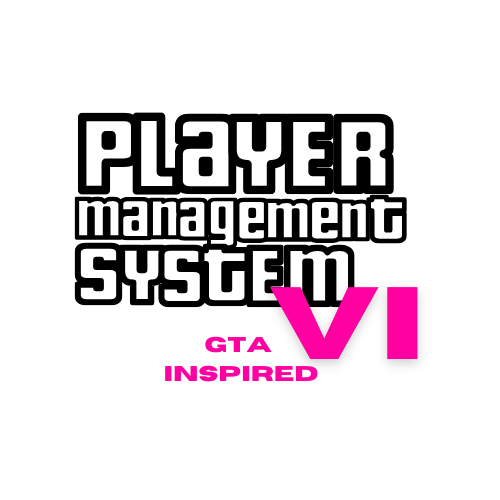

<a name="readme-top">

<br/>
<div align="center">
  <a href="https://github.com/eums046">
    
  </a>
  <h3 align="center">AWD-Seatwork-1-4-BY-25</h3>
</div>

<div align="center">
  A dynamic player management system with cyberpunk aesthetics featuring real-time leaderboards and player statistics
</div>

<br />


---

<br />

<details>
  <summary>Table of Contents</summary>
  <ol>
    <li>
      <a href="#overview">Overview</a>
      <ul>
        <li><a href="#key-features">Key Features</a></li>
      </ul>
    </li>
    <li>
      <a href="#technology-stack">Technology Stack</a>
    </li>
    <li>
      <a href="#project-structure">Project Structure</a>
    </li>
    <li>
      <a href="#resources">Resources</a>
    </li>
  </ol>
</details>

---

## Overview

A modern player management system inspired by GTA VI's visual aesthetic, featuring:

- Interactive player leaderboard with sorting capabilities
- Dynamic player entry system (max 10 players)
- Real-time score and level tracking
- Cyberpunk-inspired UI with animated elements
- Responsive design with smooth transitions

.png)

### Key Features

- 🎮 GTA VI-style landing page with bounce animation
- 📊 Auto-sorting leaderboard (name/score/level)
- 🏆 Medal system for top-ranked players
- 🚨 Interactive delete functionality with animations
- 🌈 Cyberpunk-themed UI elements:
  - Gradient borders
  - Glowing buttons
  - Scanline overlay
  - Animated form interactions

<p align="right">(<a href="#readme-top">back to top</a>)</p>

### Technology
<!-- TODO: List of Technology Used -->


### Project Structure

```
AWD-PlayerManagement
└─ assets
│   └─ css
│   │   └─ style.css       
│   └─ img
│   │   └─ VI.png          
│   └─ js
│       └─ script.js       
└─ index.html              
└─ readme.md
```
### Resources

| Title | Purpose | Link |
|-|-|-|
| Font Awesome | Icon System | fontawesome.com |
| GTA VI Assets | Visual Inspiration | rockstargames.com |
| Animate.css | Animation Library | animate.style|


